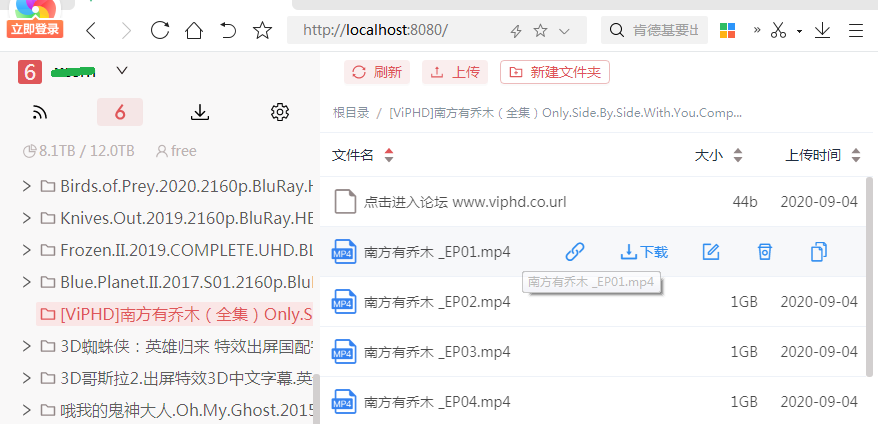

# 6盘小白羊 第二版

开饭中，预计10月底上传，UI开源

## 新版介绍

采用vue开发界面，go开发后台服务程序。无需安装，启动后调用浏览器显示UI和操作。理论上支持win/linux/mac全平台，支持远程管理(比如linux上安装，win远程操作)

## 新版功能

6盘官方网页版功能

``` diff
+ [√] 登录6盘账号(支持 手机+密码、用户名+密码、Cookie 三种方式)
+ [√] 文件功能：文件列表+排序、移动到、复制到、重命名、获取下载地址、删除到回收站
+ [√] 回收站功能：文件列表、恢复文件、彻底删除文件、清空回收站
# [√] 离线下载功能：任务列表、查看复制离线任务链接、删除离线任务、~~添加离线任务~~
# [√] 用户功能：个人信息、修改密码、WEBDAV、
# [√] 6盘官方公告
- [x] 手机绑定、其他网盘推送、删除账户、工单系统、订阅系统、分享系统 都会被屏蔽，不计划实现这些功能
```

小白羊第二版特色功能

``` diff
+ [√] 多账号同时登录管理
+ [√] 目录树快捷导航
+ [√] 文件夹批量下载
+ [√] 图片预览（单图片预览，文件夹内全部图片预览）
+ [√] 自研下载引擎：多文件同时下载，每个文件都会多线程并发下载，提升下载速度。
+ [√] 文件下载支持断点续传，不受6盘下载链接时效限制，可以下载大文件（20-30GB单文件）
+ [√] 文件上传功能：支持多文件、文件夹批量上传，支持断点续传，支持文件秒传功能
# [√] 多平台支持：支持windows全系，支持linux（ubuntu，centos，统信等等），~~支持mac os~~
# [ ] 远程管理功能：~~支持通过在浏览器输入IP，远程管理所有功能~~
- [ ] RSS订阅功能：~~订阅资源秒传~~
```

*注：类似 ~添加离线任务~ 是指正在开发中的功能，并未完善  
*注：小白羊第二版已去除内置账号，用户使用自己的账号提交百度分享任务  
*注：小白羊第一版因为6盘官方限制并发数太严格，如果你的网速很快，会遇到下载一段时间后速度为0，等1-2分钟后才能恢复下载的BUG。第二版已修此问题  


截图：

